# CargoPlus 货代邮件智能结构化抽取平台 · 产品需求文档 (PRD)

---

## 1. 文档概述

| 文档版本 | 更新日期 | 适用对象 | 状态 |
| :--- | :--- | :--- | :--- |
| **V3.2.0 (Enterprise GA)** | 2026-08-19 | 产品经理、架构师、研发工程师、货代企业用户、系统管理员 | **已发布 (正式生产版本)** |

---

## 2. 业务背景与问题痛点

### 2.1 行业现状
国际货运代理（Freight Forwarding）业务每日产生大量非结构化海运单证交互，主要通过电子邮件沟通。业务人员每日需人工阅读成百上千封订舱委托、到港通知（Arrival Notice）、放单保函、提单（B/L）确认件及多格式附件（PDF、Excel 箱单、Word、扫描图片）。

### 2.2 核心痛点
1. **人工录入成本高、效率低**：一封复杂拼箱或多集装箱订舱单录入耗时 3~8 分钟，易产生错漏；
2. **格式极其繁复多变**：既有中英混排文本，又有复杂 Excel 表格、多页扫描 PDF 提单；
3. **单证字段多达 57+ 项**：涵盖发货人（Shipper）、收货人（Consignee）、通知人（Notify）、起运港（POL）、目的港（POD）、中转港、船名航次、截关截单时间、集装箱号（ContainerNo）、封条号（SealNo）、箱型尺寸（20GP/40HQ）、件毛体（KGS/CBM/PCS）及危险品类型等；
4. **高并发削峰与 SLA 严苛**：早间 09:00~11:00 为邮件高峰期（日均 5,000~10,000 封），需要 5 分钟内完成全流程解析与回调推送，且扣费必须 100% 准确（失败严格免扣费）。

---

## 3. 产品定位与核心目标

**CargoPlus** 是一套面向国际货代、跨境电商物流、集装箱海运企业的**工业级多模态邮件与单证智能抽取 SaaS/私有化 API 平台**。
- **底层驱动**：基于商汤科技大模型 (`deepseek-v4-flash-0731`) + Skill V3 57 字段规范；
- **准入安全与商业模式**：
  - **自助注册开户与人工审核准入**：货代租户注册后默认进入【待审核】状态（`is_active=False`），待管理员后台审核通过后方可激活登录与调用，杜绝恶意注册；
  - **新用户体验金**：注册成功预分配 ¥50.00 试用金 (100 次免费抽取额度)；
  - **动态单价与并发上限**：管理员可在后台按租户动态调整调用单价（¥0.01 ~ ¥100.00/次，默认 0.50 元/次）及最大并发上限（1 ~ 30 并发）；
  - **原子预留与成功计费**：任务提交预留额度，抽取成功才原子扣费，失败/超时 0 扣费；
- **全链路能力**：多模态附件解析 $\rightarrow$ 智能长文本压缩 $\rightarrow$ 大模型抽取 $\rightarrow$ 规则归一化 $\rightarrow$ 异步削峰队列 $\rightarrow$ HMAC-SHA256 签名 Webhook 回调 $\rightarrow$ 租户财务日账单/流水全量分页对账与 CSV 导出。

---

## 4. 核心功能矩阵 (Feature Matrix)

```mermaid
graph TD
    A[CargoPlus 核心产品能力] --> B[多模态单证解析引擎]
    A --> C[Skill V3 结构化抽取]
    A --> D[多租户与商业化计费]
    A --> E[异步削峰队列与自愈]
    A --> F[安全防御与数据隔离]
    A --> G[现代化控制台与对账门户]

    B --> B1[.eml 邮件正文/HTML递归解析]
    B --> B2[多页 PDF / RapidOCR 图片识别]
    B --> B3[Excel 多 Sheet/合并单元格表格提取]
    B --> B4[Word .docx 文档提取]

    C --> C1[57 顶层字段 + 13 集装箱子字段]
    C --> C2[中英货名智能拆分]
    C --> C3[件毛体数值与单位智能分离]
    C --> C4[箱型箱量与海运代码归一化]

    D --> D1[租户注册人工审核准入机制]
    D --> D2[租户单价与并发上限动态配置]
    D --> D3[预留机制与 0 失败扣费保证]
    D --> D4[日账单/流水全量标准分页对账]

    E --> E1[Celery/Redis 分布式信号量公平调度]
    E --> E2[断电/重启遗留任务自动恢复自愈]
    E --> E3[HMAC-SHA256 Webhook 指数退避重试]

    F --> F1[Webhook SSRF 公网白名单防御]
    F --> F2[上传路径穿越防范]
    F --> F3[90 天附件自动生命周期清理]
    F --> F4[租户数据强隔离与防越权]

    G --> G1[管理员总控台与多租户审核]
    G --> G2[租户财务对账中心与 CSV 导出]
    G --> G3[租户 API Key 独立管理与免密登录]
    G --> G4[无原生 alert 弹窗现代化 Toast 交互]
```

---

## 5. 详细功能说明

### 5.1 租户生命周期与准入控制
1. **自助开户注册**：货代企业通过 `/register` 填写企业名称、邮箱及密码，开户申请提交后默认状态为【待审核】；
2. **管理员审核激活**：管理员在总控台可一键审核开通租户，激活后租户方可登录系统及发起 API 任务；
3. **租户 API Key 管理**：租户登录后可在对账中心直接查看与一键复制专属的 API Key 及 Webhook Secret，支持使用 API Key 凭证免密登录；
4. **状态真实管理**：彻底移除“禁默/软删除”状态，租户与密钥支持启用/禁用/删除真实管理。

### 5.2 邮件与多模态解析能力
- **.eml / .msg 邮件解析**：自动分离邮件主题、纯文本/HTML 正文，并递归提取内嵌附件（单邮件上限 10 个附件）；
- **PDF 多页与 RapidOCR 图像处理**：智能提取文本层，对扫描件执行 RapidOCR 本地高精度识别，支持前 20 页防 DoS 截断；
- **Excel 结构化提取**：自动读取全部 Sheet，剔除空行并转为 Markdown 表格，单 Sheet 前 100 行保护；
- **Word (.docx) 提取**：提取文档段落与表格内容。

### 5.3 字段标准化与归一化 (Skill V3 核心业务规则)
1. **单证主体（Shipper / Consignee / Notify）**：
   - 自动将多行地址中的企业名称剥离；
   - 自动提取文本中的 `TEL:`、`FAX:`、`EMAIL:`，分别归一化至独立字段。
2. **港口与航程信息**：
   - 起运港（POL / POLName）、目的港（POD / PODName）、收货地（POR）、交货地（DeliveryCode / DeliveryName）、预计开航日（ETD）、预计到达日（ETA）、船名（Vessel）、航次（Voyage）。
3. **集装箱信息（ContainerInfo 数组）**：
   - 集装箱号（ContainerNo）、封条号（SealNo）；
   - 箱型尺寸（ContSize: `20`/`40`/`45`/`LCL`，ContType: `GP`/`HQ`/`FR`/`NOR`/`OT`/`RF`）；
   - 无法归类的非标箱型自动追加到 `Remark`。
4. **货品与计量分离**：
   - 件数与包装（`Packages` + `PackagesUnit`，如 `500 CARTONS` 自动拆分为 `500` 和 `CARTONS`）；
   - 重量与体积（`GrossWeight` + `GrossWeightUnit`，`Volume` + `VolumeUnit`）；
   - 货名中英文自动拆分（`GoodsName` 英文，`GoodsNameCN` 中文）；
   - 货物性质智能归纳（`GoodsType`: `S` 普货 / `R` 冷藏 / `D` 危险品 / `O` 超标货物）。

### 5.4 商业化计费与财务对账系统
- **原子预扣与成功扣费**：
  - 任务创建时首先检查余额并原子预留本次费用（不足返回 `402 Payment Required`）；
  - 任务抽取成功且通过 V3 校验后，原子扣减余额并生成 `DEDUCTION` 账单流水；
  - 任务失败、超时或取消时自动释放预留金额，余额无损；
- **全页面数据分页**：日账单、流水明细、任务列表全量支持 `page` 与 `page_size` 分页参数；
- **电子账单导出**：支持一键导出 CSV 电子对账单，包含期初/期末余额、调用次数、扣费金额及详细流水编号。

### 5.5 现代化交互规范
- 全系统杜绝使用原生浏览器 `alert()` 与 `confirm()` 阻塞弹窗；
- 全量采用优雅的非阻塞 Toast 提示框与自定义 Modal 确认框，保障多单证高频操作的流畅度。
