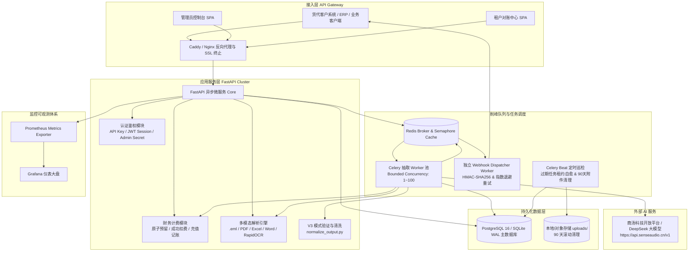
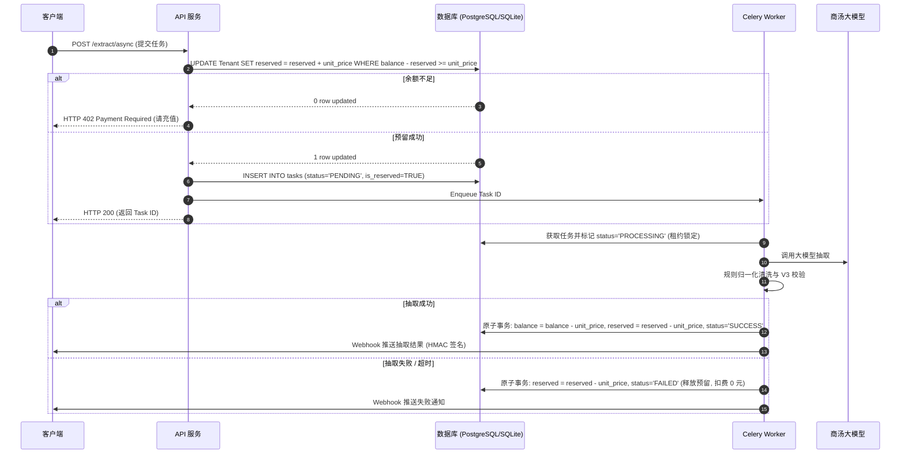
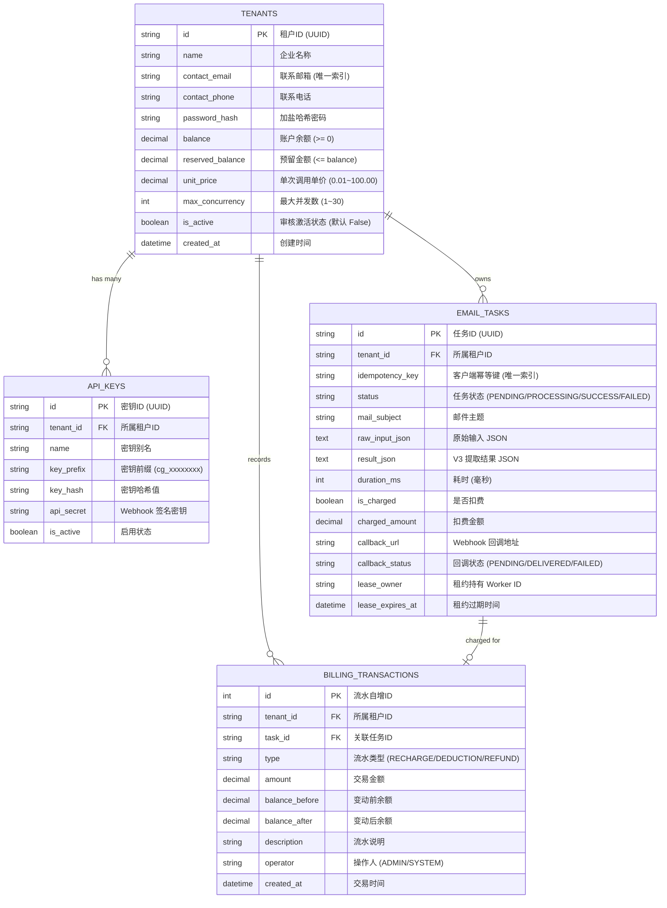

# CargoPlus 系统架构设计说明书 (System Architecture Design)

---

## 1. 系统总体技术架构

CargoPlus 采用现代微服务架构，基于 Python 异步生态（FastAPI + SQLAlchemy 2.0 Async + Celery/Redis）构建，实现**多模态单证解析、大模型智能抽取、规则化归一化、分布式削峰队列与原子商业化计费**的一体化闭环。

---

## 2. 核心模块架构设计

### 2.1 多模态单证解析与 OCR 引擎 (`app/core/parser/`)
- **调度分发中心 (`__init__.py`)**：根据文件 MIME/扩展名自动路由至专用解析器；
- **邮件解析 (`eml_parser.py`)**：利用标准 Python `email` 模块解析 RFC822 结构，递归提取内嵌正文与附件，HTML 正文利用自定义算法转为干净的 Markdown 纯文本；
- **表格解析 (`excel_parser.py`)**：利用 `openpyxl` 提取多 Sheet 表格，空行过滤并渲染为标准 Markdown 表格，单 Sheet 前 100 行限额保护；
- **文档解析 (`pdf_parser.py`, `word_parser.py`)**：利用 `pypdf` 与 `python-docx` 提取文档层文本与表格；
- **本地 OCR 引擎 (`ocr_engine.py`)**：基于 `rapidocr_onnxruntime` 构建本地高性能轻量 OCR 引擎，对各类海运单证扫描图片进行高精度文字识别。

### 2.2 规则归一化流水线 (`app/core/normalizer.py`)
- 严格遵循 `cargo-mail-extraction-skill-v3` 规范：
  1. **收发通主体分离**：`ShipperAddr` 自动剥离首行抬头，提取 `TEL:`、`FAX:`、`EMAIL:`；
  2. **件重体分离**：`Packages`、`GrossWeight`、`Volume` 数值与包装单位精确拆分；
  3. **品名中英文分离**：根据 CJK 字符区间智能拆分中英文品名；
  4. **箱型代码归一**：依据标准海运箱型代码对照表（`20GP`、`40HQ`、`45HQ`、`NOR`、`RF` 等）进行规范化转换。

### 2.3 原子计量扣费与预留锁机制 (`app/services/billing_service.py`)
为了杜绝高并发下超额欠费排队与重复扣费，系统采用 **二阶段原子扣费机制**：

### 2.4 分布式削峰队列与自愈恢复 (`app/services/queue_service.py` & `app/celery_tasks.py`)
- **租户并发隔离**：基于 Redis Lua 脚本原子信号量，限制单租户活跃执行任务数不超过配置上限（1~30），超出返回 `HTTP 429`（附带 `Retry-After: 3`）；
- **任务租约与超时自愈**：每个执行中任务获得 60s 数据库 Lease 租约，Celery Beat / 本地恢复巡检定时扫描超期租约任务并重新入队，确保断电重启零丢单；
- **独立 Webhook 消费**：Webhook 回调任务投递至独立队列，慢速客户服务器不影响主抽取流水线吞吐。

---

## 3. 数据模型设计 (Database Schemas)

---

## 4. 关键安全与可用性指标

| 指标维度 | 设计规范与保障措施 |
| :--- | :--- |
| **资金一致性保障** | 数据库 CHECK 约束、原子 UPDATE 条件更新、幂等防重扣保证 100% 账实相符 |
| **SSRF 防御** | Webhook URL 解析验证，强制阻断 RFC1918 私网、127.0.0.1、169.254.169.254 等私有网段 |
| **身份与权限隔离** | JWT Session 签名、PBKDF2 强哈希密码存储、租户级数据隔离防越权 |
| **单证防 DoS 截断** | 邮件附件数上限 10、PDF 单文件上限 20 页、Excel 单表上限 100 行、文本最大 10,000 字符 |
| **附件生命周期清理** | 后台每天自动扫描 `uploads/`，安全删除 90 天前原始附件，结构化 JSON 永久归档 |
| **代码测试覆盖率** | 183 项自动化单元与集成测试用例，**全后端代码覆盖率达 95.0%** |
